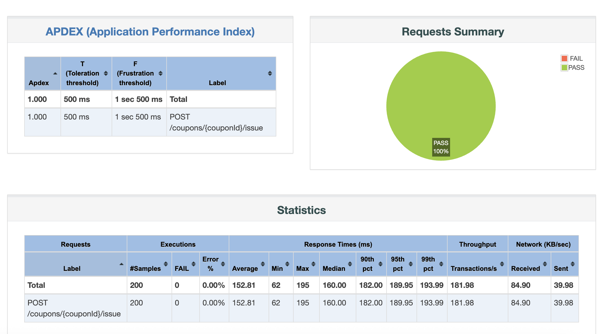
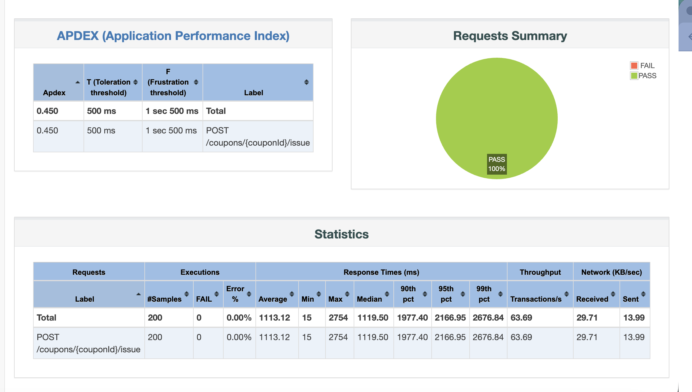
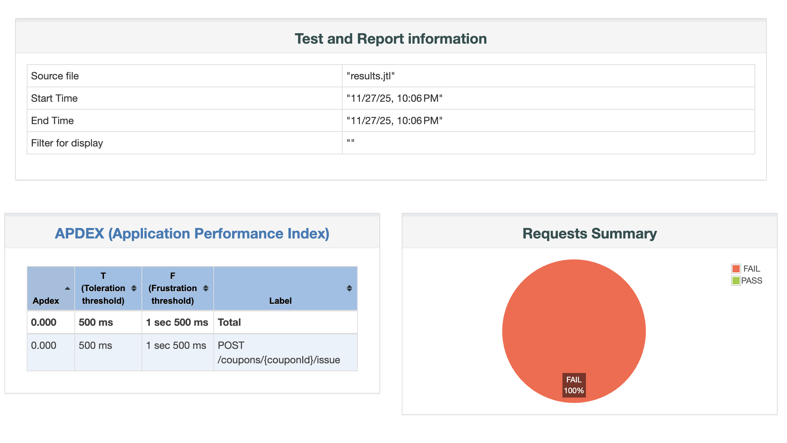
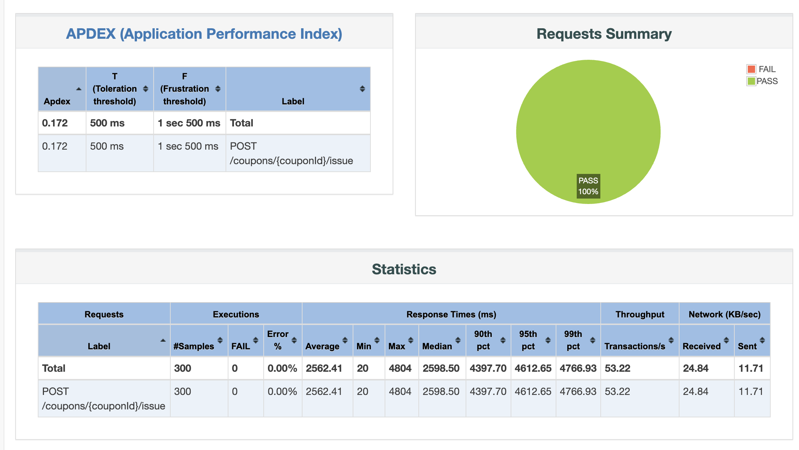
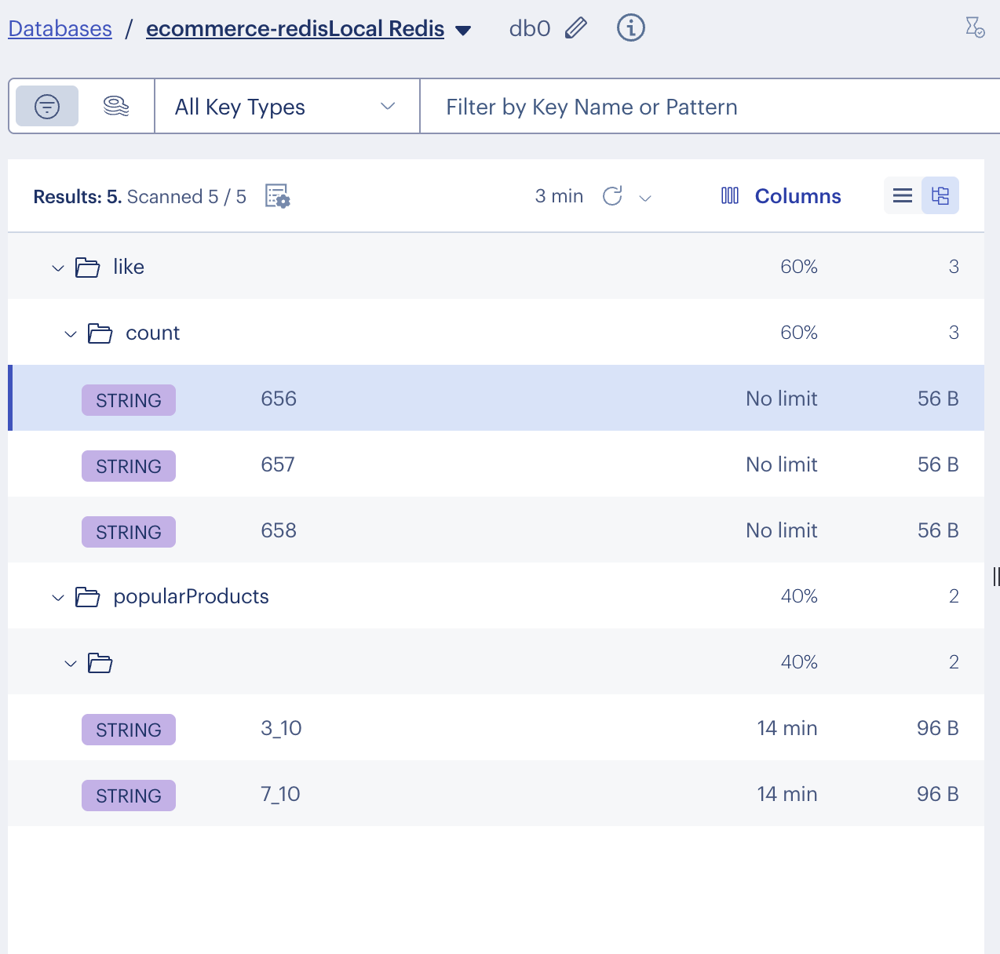
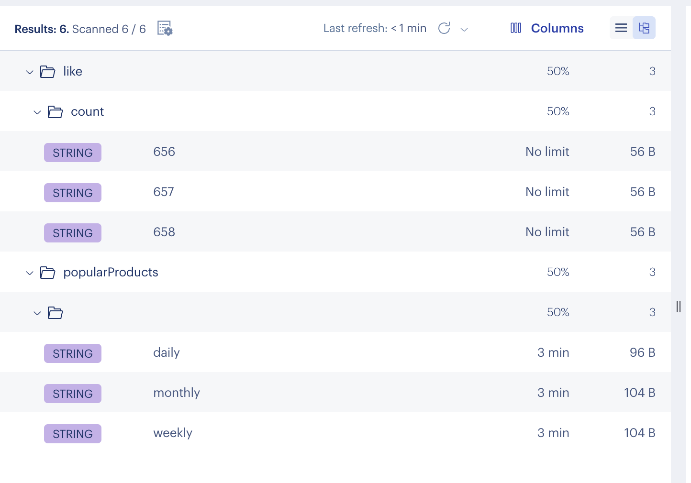

# 분산락 및 캐시 적용 보고서 

# 1) 분산락 

## 구현방식
- 락 획득 > 트랜잭션 시작 > 로직 수행 > 트랜잭션 종료 > 락 해제 프로세스를 지키기 위해 락 획득 및 해제에 대하여 커스텀 AOP로 구현해 보았습니다.

## 1-1. 선착순 쿠폰
해당 보고서는 5주차에 jmeter를 통해 동시성 테스트를 진행했던 선착순 쿠폰에 대하여 분산락으로 변경 후
성능 건에 대해 작성하였습니다.

## 선착순 쿠폰 성능 테스트
 - 비관적 락 > 분산락으로 변경 하였습니다.
 - 성능 테스트 도구 : jmeter

### 1초당 200req
  - 비관적 락 사용  성능 테스트 결과
  
  - 분산락 사용 성능 테스트 결과
  
- 성능비교표

| 지표 | 비관적 락 | 분산락 | 차이 |
|------|-----------|--------|------|
| **평균 응답 시간** | 567ms | 1,113ms | 2배 느림 |
| **최소 응답 시간** | 91ms | 54ms | - | 
| **중앙값 (50%ile)** | 650ms | 752ms | 16% 느림 |
| **90%ile** | 720ms | 1,977ms | 2.7배 느림 | 
| **95%ile** | 729ms | 2,166ms | 3배 느림 | 
| **최대 응답 시간** | 742ms | 2,676ms | 3.6배 느림 | 
| **처리량 (req/min)** | 133.2 | 63.7 | 2배 높음 | 
| **처리량 (req/sec)** | 2.22 | 1.06 | 2배 높음 | 
| **APDEX 점수** | 0.640 | 0.450 | 42% 높음 | 
| **성공률** | 100% | 100% | 동일 | 
| **에러 발생** | 0건 | 0건 | 동일 |
| **응답시간 편차** | 651ms | 2,622ms | 4배 안정적 |

### 1초당 300req
- 비관적 락 사용  성능 테스트 결과
  
- 분산락 사용 성능 테스트 결과
  
- 비교 : 비관적 락으로 시도시에는 모든 요청이 실패하였으나, 분산락으로 전환 후 모든 요청이 성공하였습니다.

### 결론 
분산락의 처리 성능이 훨씬 좋을 줄 알았으나, 반대의 결과가 나왔습니다
분산락 디폴트 설정값인 leaseTime 3초 ,waitTime 5초가 너무 점유율이 긴가 싶어 줄여 보았으나,비슷했습니다. 
성능에 있어서는 분산락이 더 빠를 수 있고, 1초당 300요청도 커넥션 수를 늘리면 성공할수도 있겠으나, 커넥션 수를 늘리는 것이 좋은 방안은 아니라고 생각했습니다.
이에 따라 안정성에 있어서는 분산락이 더 높기때문에 분산락을 사용하는 것이 아닐까 생각해 보는 테스트 였습니다. 

## 1-2. 잔액 차감
- 충전과 차감모두  @DistributedLock(key = "'user:balance:' + #userId") 처럼 동일한 아이디로 지정하여 동시에 충전 및 차감 진행시 순차적으로 진행 될 수 있도록 구현하였습니다.

## 1-3. 재고 차감
- 해당 프로젝트에서 가장 긴 프로세스인 주문시 재고 차감이 이루어져야 했기에 주문서비스에 대하여 락을 거는 것을 고민하였으나, 락을 걸어야 하는 대상은 재고 차감 로직만 해당 한다고 생각했습니다. 
주문 프로세스에 대해 락을 거는 것은 테이블 락을 거는 듯한 기분이 들었습니다..이에 따라 재고 차감 로직에만 분산락을 걸기 위해 트랜잭션을 새로 분리 하였고, 실패시 보상 트랜잭션으로 재고를 복구시키는 로직을 넣어 두었습니다.
이에 따라, 재고 차감 이후 주문 실패건, 동시 주문 생성 시 재고 부족건에 대하여 모두 보장할 수 있게 될뿐만 아니라, 재고 차감시에만 락을 걸어 락 점유 시간을 낮출 수 있었습니다.

# 2) 캐시

## 2-1. 상품 목록 조회
- `@Cacheable(cacheNames = "products", key = "'all'")` 을 사용하여 전체 상품 목록을 캐싱 처리하였습니다. 
- 상품 정보 수정 시 `@CacheEvict(cacheNames = "products", allEntries = true)` 를 사용하여 관련 캐시를 모두 무효화 처리하였습니다.

## 2-2. 인기 상품 조회
- `@Cacheable(cacheNames = CacheType.Names.POPULAR_PRODUCTS, key = "#command.days + '_' + #command.limit")`로  조회 조건에 따라 선택적 캐싱을 적용하였습니다. 

## 2-3. 상품 좋아요 기능
- 스케줄러를 통해 주기적으로 Redis의 좋아요 수를 DB에 반영하는 방식으로 구현하였습니다. 좋아요 조회는 redis로 하되, 6시간마다 db에 반영했습니다.
  DB likeCount 용도:
    - 스냅샷 기록 (백업)
    - 통계/분석용
    - Redis 장애 시 복구용

## 2-4. 캐시 확인
- redis-insight를 사용하여 캐시 확인을 했습니다.

- 인기상품 캐싱 일간/주간/월간으로 변경
- 

# 3) 후기
재고 차감 분산락 구현의 경우 보상 트랜잭션을 넣었으나, 네트워크 장애, DB 장애등으로  보상 트랜잭션이 실패할 경우에서는 해당 로직으로는 해결 할 수 없다는 한계가 있는 것 같습니다.
결국엔 아웃박스나 사가 패턴 , 이벤트 기반 프로세스로 가기 위한 과정같이 느껴지는 과제였습니다..

