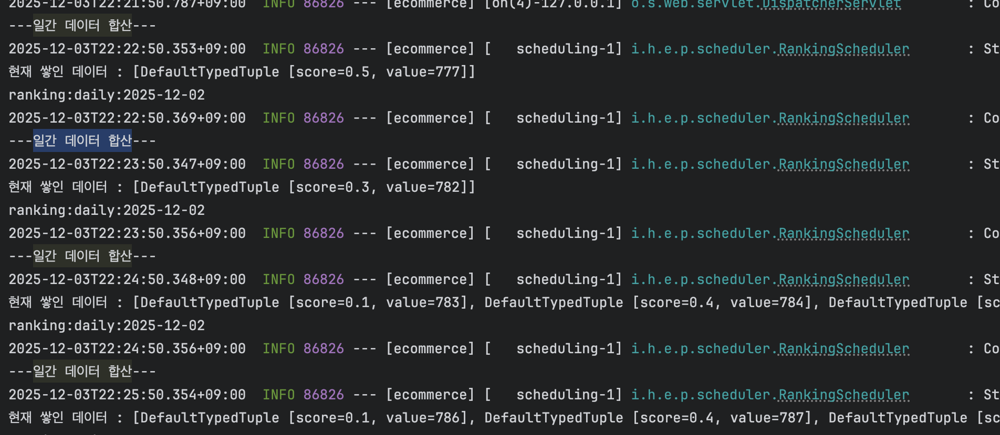
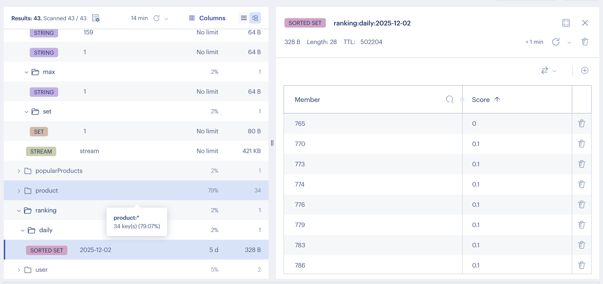

# <STEP 13,14 구현 보고서>

# 1. STEP13 실시간 주문 랭킹

## 1) 구현
- 조회, 주문, 좋아요 api 호출시 일자 기준으로 상품 아이디 별로 랭킹 점수를 계산합니다.(  RANKING_POPULAR("ranking:popular:%s", Duration.ofDays(30)))
- RANKING_POPULAR는 30일 동안 보관하며 일간,주간,월간 데이터의 기초데이터로 활용합니다.
- 일간은 매일 자정, 주간은 매주 월요일, 월간은 매월 1일날 생성 됩니다.
- 데이터가 존재하지 않아도, redisTemplate.opsForZSet().add(targetKey, "EMPTY", 0);으로 빈 데이터를 생성합니다. 빈데이터 저장하는 이유는 수집을 완료했다는 데이터로 활용하기 위함입니다.
- 주간 이전 7일 , 월간 데이터는 전월의 일수데이터를 일간 데이터에서 가져옵니다. 이 때 가져와야 하는 날짜 key가 없을 경우, 다시 수집 처리 하도록 합니다.(saveDayRankingData) 
- 가져와야 하는 날짜 key가 없을 경우는 네트워크 장애로 인해 스케줄러가 정상적으로 작동하지 않았을때를 가정하였습니다.

## 2) 구현 방식
- sorted set을 사용하여 일간 데이터를 순위와 함께 저장합니다. 
- unionAndStore를 사용하여 위에서 수집한 일간 데이터를 합집합 데이터를 생성합니다.

- 테스트 코드를 통해 좋아요,조회,주문,카테고리 랭킹 반영 이후 1분당 일간 데이터를 집계하도록 테스트 해보았고, 레디스에 정상 반영되는것을 확인 하였습니다.
  
  

# 2. STEP14 선착순 쿠폰

## 1) 구현 단계
- 선착순 쿠폰 프로세스를  기존에 구현했던 분산락 방식에서 redis stream로 변경하였습니다.
- 1차 개선 비관락 적용 보고서 
- 2차 개선 분산락 보고서 

## 2) redis stream 선정이유
- sorted set을 사용하여 timestamp 순서대로 정렬후 처리 하는 방식을 고민 하였으나, sorted set을 사용할 경우 요청을 담은 후 배치 처리를 통해 RDB에 저장하는 식으로 구현을 해야했습니다.
  그러나 선착순 쿠폰이라고 하여도 1000개의 쿠폰에 요청량이 적어 300명만 신청하였을경우 나머지 700개가 모두 수량이 찰때까지 배치처리를 계속 호출하는 것이 불필요한 과정이라고 생각했습니다. 이에 따라
  배치 처리는 트래픽이 몰릴 때만 효율적이라고 생각하여 선착순 쿠폰 요청시 바로 처리할 수 있는 redis stream을 사용하여 구현해 보았습니다.

## 3) 구현 방식
- 1. sorted Set로 저장 >  배치 요청을 담은 후 배치 처리를 통해 RDB에 저장 > 1000개의 쿠폰에 요청량이 적어 300명만 신청하였을경우 나머지 700개가 모두 수량이 찰때까지 배치처리해야 하는 문제
- 2. 모든 요청을 redis stream에 저장 > 1000개의 쿠폰인데 5000개 요청일 경우 나머지 4000명의 유저는 대기번호를 발급받으나 결과는 실패로 리턴하게 됨, 사용자 관점에서 옳지 않다고 판단하였음.
- 3. 중복 요청, 쿠폰 발급 가능 상황 확인 >  redis stream에 저장 > Stream 리스너가 RDB에 저장 > 1,2 문제 해결

## 4) 테스트
  해당 보고서는 5,6주차에 jmeter를 통해 동시성 테스트를 진행했던 선착순 쿠폰에 대하여 분산락으로 변경 후
  성능 건과 비교하여 작성하였습니다.

## 선착순 쿠폰 성능 테스트
 - 비관적 락 > 분산락 > redis stream 으로 변경 하였습니다.
 - 성능 테스트 도구 : jmeter

### 1초당 200req
  - 1차 개선 비관적 락 사용  성능 테스트 결과
  
  - 2차 개선 분산락  사용 성능 테스트 결과
  
  - 3차 개선 redis stream 사용 성능 테스트 결과
  - 
- 성능비교표

| 지표 | 비관적 락 | Redis 분산락 | Redis Stream | 차이 (Stream 기준) |
|------|-----------|--------------|--------------|-------------------|
| **평균 응답 시간** | 1,113ms | 567ms | 7.6ms | 비관적락 대비 146배 빠름 / 분산락 대비 75배 빠름 |
| **최소 응답 시간** | 1ms | 650ms | 0ms | - |
| **중앙값 (50%ile)** | 1,119.5ms | 720ms | 10ms | 비관적락 대비 112배 빠름 / 분산락 대비 72배 빠름 |
| **90%ile** | 1,977ms | 729.9ms | 48ms | 비관적락 대비 41배 빠름 / 분산락 대비 15배 빠름 |
| **95%ile** | 2,167ms | 743ms | 48ms | 비관적락 대비 45배 빠름 / 분산락 대비 15배 빠름 |
| **99%ile** | 2,677ms | 133.16ms | 210.97ms | 비관적락 대비 13배 빠름 / 분산락 대비 1.6배 느림 |
| **최대 응답 시간** | 5,275ms | 1,745ms | 2,484ms | 비관적락 대비 2.1배 빠름 / 분산락 대비 1.4배 느림 |
| **처리량 (req/min)** | 1,782 | 3,726 | 4,318 | 비관적락 대비 2.4배 높음 / 분산락 대비 1.2배 높음 |
| **처리량 (req/sec)** | 29.71 | 62.11 | 71.97 | 비관적락 대비 2.4배 높음 / 분산락 대비 1.2배 높음 |
| **APDEX 점수** | 0.450 | 0.640 | 1.000 | 비관적락 대비 122% 향상 / 분산락 대비 56% 향상 |
| **성공률** | 100% | 100% | 100% | 모두 동일 |
| **에러 발생** | 0건 | 0건 | 0건 | 모두 동일 |
| **응답시간 편차** | 5,274ms | 1,095ms | 2,484ms | 비관적락 대비 2.1배 안정적 / 분산락 대비 2.3배 불안정 |

#  결론 
레디스 스트림을 적용하여 큐를 적용한것이 훨씬 빠른 성능을 보여주었습니다.
구현하고 테스트 하는데는 조금 더 까다로워 진것 같긴 하지만...엄청난 성능 개선이 된 것이 눈에 띄게 보여서 뿌듯했습니다.
다만 비동기로 진행되다 보니, 이벤트 실패와 같은 경우의 대응 방법이 더욱 까다로워 지는 문제도 발생할 것 같습니다. 

