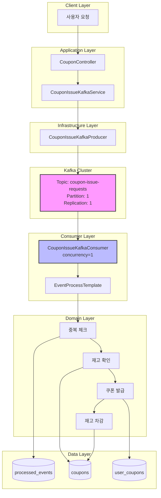
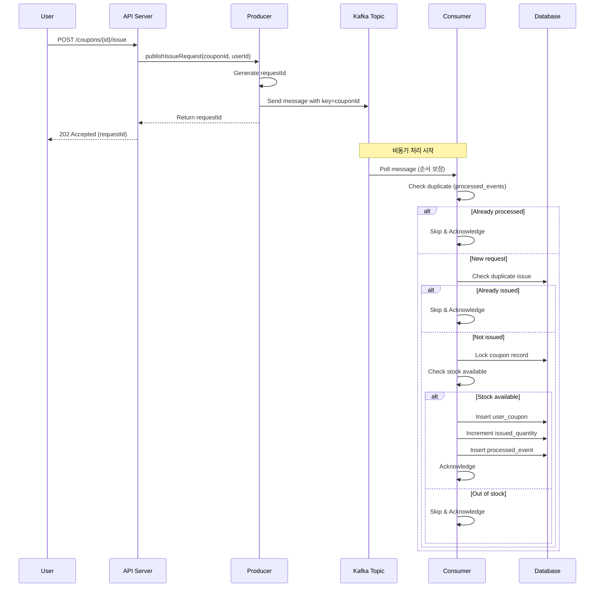

# Kafka 기본 개념 학습 및 설계 문서

## 1. Kafka란

### 주요 특징
- **메시지 영속성**: 디스크에 저장되므로 데이터 유실 위험이 적음
- **높은 처리량**: 초당 수백만 건의 메시지 처리 가능
- **확장성**: 브로커를 추가해서 수평 확장 가능
- **순서 보장**: 파티션 내에서 메시지 순서 보장

## 2. Kafka 핵심 구성 요소

### Producer
- 메시지를 발행하는 주체. 
- 해당 프로젝트에서는 `CouponIssueKafkaProducer`가 쿠폰 발급 요청을 Kafka로 보냅니다.

### Consumer
- 메시지를 소비하는 주체. 
- `CouponIssueKafkaConsumer`가 Kafka에서 메시지를 가져와서 실제 쿠폰 발급 처리 합니다.

### Topic
- 메시지가 저장되는 공간. 
- 파일 시스템의 폴더처럼 메시지를 분류하는 용도
- 쿠폰 선착순에서는 `coupon-issue-requests` 토픽, 주문에서는 `order-event`를 사용합니다.

### Partition
- 토픽 안에서 메시지를 나누는 단위. 
- 파티션을 여러 개 만들면 병렬 처리가 가능하지만, 쿠폰 선착순의 경우 순서 보장을 위해 단일 파티션을 사용했습니다.

### Consumer Group
- 여러 Consumer를 묶어서 하나의 그룹으로 관리,
- 같은 그룹 내 Consumer들은 파티션을 나눠서 처리하므로 중복 소비가 발생하지 않도록 해줍니다.

### Offset
- Consumer가 어디까지 메시지를 읽었는지 기록하는 위치 정보. 이걸 잘 관리해야 메시지를 중복 처리하거나 누락하지 않는다.


## 3.  플로우
- 우리 프로젝트에서 Kafka를 사용한 쿠폰 발급 프로세스는 다음과 같습니다.

### 발급 요청 (Producer)
1. 사용자가 쿠폰 발급 API 호출
2. `CouponIssueKafkaProducer`가 메시지 생성
3. Kafka Topic에 메시지 발행
4. 사용자에게 즉시 응답 (비동기)

### 발급 처리 (Consumer)
1. `CouponIssueKafkaConsumer`가 메시지 수신
2. EventProcessTemplate로 메시지 파싱
3. 중복 이벤트 체크 (ProcessedEvent)
4. 재고 확인 및 쿠폰 발급
5. DB 저장 완료 후 ACK 커밋

### 메시지 포맷

```json
{
  "id": "1-100-uuid",
  "type": "CouponIssueCommand",
  "domain": "COUPON",
  "payload": {
    "couponId": 1,
    "userId": 100,
    "requestId": "1-100-uuid"
  }
}
```
처음에는 payload만 보냈는데,  중복 체크와 도메인 분리를 하고 EventProcessTemplate이라는 공통 컴포넌트를 만들어 
처리하고 싶어서 해당 형태로 보내도록 변경했습니다.

## 4. 주요 설정

### 순차처리 보장(쿠폰에 한함)

```java
@KafkaListener(
    topics = "coupon-issue-requests",
    groupId = "coupon-issue-processor",
    concurrency = "1"  // 중요!
)
```
- `concurrency=1`로 설정해서 Consumer가 순차적으로 메시지를 처리하도록 했습니다.

### 중복 사용 방지

```
- BOOTSTRAP_SERVERS: localhost:9092
- ACKS_CONFIG: all (모든 replica가 받을 때까지 대기)
- RETRIES_CONFIG: 3 (실패 시 3번 재시도)
- ENABLE_IDEMPOTENCE_CONFIG: true (중복 메시지 방지)
```

- `ACKS=all`과 `IDEMPOTENCE=true`
 설정으로 메시지가 정확히 한 번만 전달되도록 보장했했습니다.
 처음에는 기본 설정으로 했다가 메시지가 중복 발행되는 경우를 경험해서 이 설정을 추가했습니다.

```java
if (processedEventRepository.existsById(eventId)) {
    log.info("이미 처리된 이벤트");
    ack.acknowledge();
    return;
}
```
- 이벤트 처리시 중복 사용을 막기위해 processd_event 테이블을 만들어 검증 로직을 추가했습니다.


### 수동 커밋

```java
@Transactional
public void handleCouponIssue(CouponIssueCommand command) {
    // 1. 중복 체크
    // 2. 재고 확인
    // 3. 쿠폰 발급
    // 4. DB 저장
}

// 모든 처리가 끝난 후
ack.acknowledge();
```

```
- ENABLE_AUTO_COMMIT: false (수동 커밋)
- AUTO_OFFSET_RESET: earliest (처음부터 읽기)
- MAX_POLL_RECORDS: 10 (한 번에 10개씩)
- ACK_MODE: MANUAL (수동 ACK)
```

- 자동 커밋을 사용하면 처리 중 에러가 발생해도 offset이 커밋되어 메시지가 유실될 수 있다고 판단해서,
그래서 수동 커밋으로 설정하고, 처리가 완전히 끝난 후에만 ACK를 보내도록 구현했습니다.


## 5.전체 아키텍처



### 처리 플로우




## 6. 실제 적용하면서 겪은 문제들

### 문제 1: Consumer가 메시지를 소비하지 않음
증상: Producer가 메시지를 보내도 Consumer가 처리하지 않음
원인: Consumer의 group-id가 중복되거나, offset이 이미 커밋되어 새 메시지가 없다고 판단
해결: Consumer Group을 새로 만들거나 offset을 reset

### 문제 2: 메시지 파싱 실패
증상: Consumer에서 deserialize 에러 발생
원인: Producer가 보낸 메시지 포맷과 Consumer가 기대하는 포맷이 다름
해결: EventProcessTemplate을 만들어서 메시지 포맷을 통일

### 문제 3: 처리 중 에러 발생 시 무한 재시도
증상: 에러가 발생한 메시지를 계속 재처리해서 다음 메시지를 처리하지 못함
해결: 에러 핸들링을 추가하고, 일정 횟수 이상 실패하면 DLQ(Dead Letter Queue)로 보내도록 구현 예정


## 7. 후기
카프카를 통해 이벤트 발행 및 선착순 큐를 구현 해볼 수 있는 계기였습니다.
다만 큐같은 경우는 순서 보장을 위해 concurrency를 1로 제한하였는데, 멘토링때 말씀해주시기로는 1개의 스레드만 사용할 수 있다고 하여
트래픽이 몰릴때, 처리량이 많을때는 오히려 이전에 구현했던 레디스 스트림이 더 성능상 좋지 않을까..하는 생각이 드는 과제였습니다.
다만 이벤트 발행에 있어서는, 추적 가능성 측면에서는 카프카가 좋다는 생각이 들었습니다. 