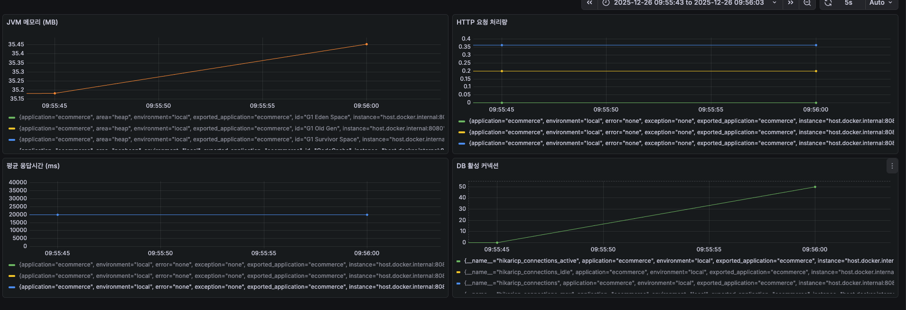
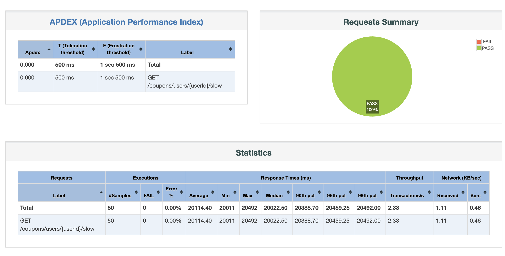
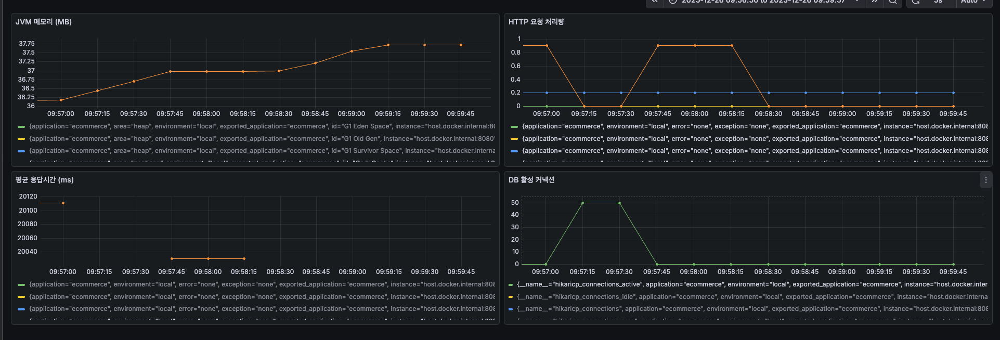
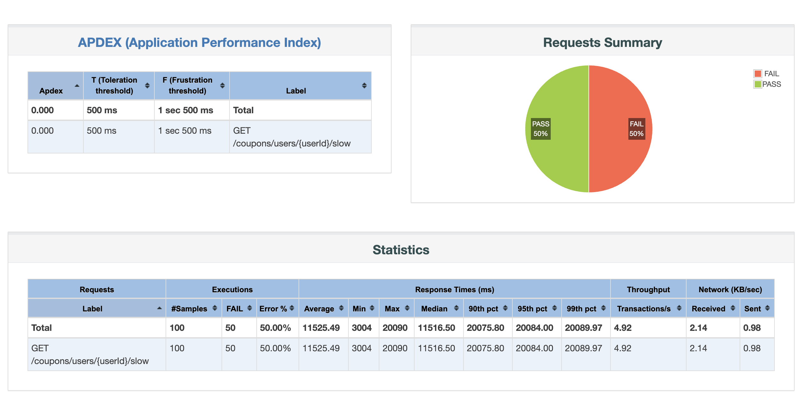
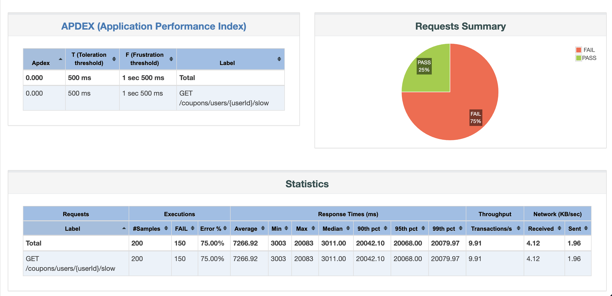
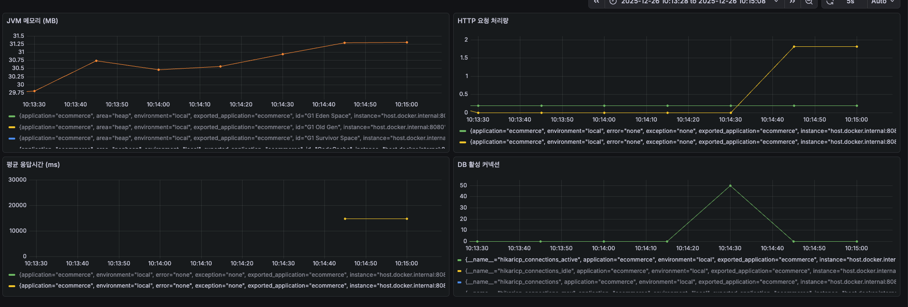
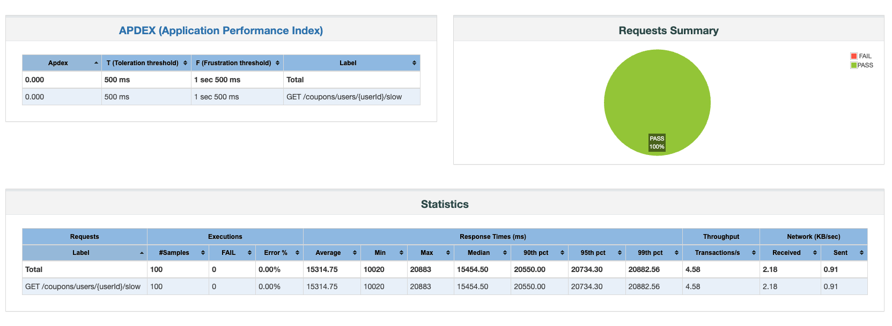

# STEP 19-20. 부하 테스트 및 병목 탐색 보고서

---

## 목차

- [1. 부하 테스트](#1-부하-테스트)
  - [1.1. Hikari Connection Pool 증설과 Tomcat 스레드 풀 조정](#11-hikari-connection-pool-증설과-tomcat-스레드-풀-조정)
  - [1.2. 비관적락 > 분산락 → Redis Streams 전환 성능 비교](#12-비관적락--분산락--redis-streams-전환-성능-비교)
- [2. 병목 탐색 및 모니터링](#2-병목-탐색-및-모니터링)
  - [2.1. 선착순 쿠폰에서의 병목](#21-선착순-쿠폰에서의-병목)
  - [2.2. 슬로우 쿼리에서의 병목](#22-슬로우-쿼리에서의-병목)
- [3. 결론](#3-결론)

---

## 1. 부하 테스트
선착순 쿠폰 발급 API에 대한 부하 테스트 및 병목 탐색 보고서입니다.
이전 주차에 JMeter를 통해 부하테스트를 진행하였고, 그 과정에서 여러 설정들을 수정하여 성능 개선을 진행하였습니다.
**개선 과정**: 1차 비관락 적용 → 2차 분산락 적용 → 3차 Redis Streams 적용

### 1.1. Hikari Connection Pool 증설과 Tomcat 스레드 풀 조정

관련 문서: [ConnectionPool설정값조정](./concurrency_report.md)

#### 설정 내용

```properties
# Tomcat Thread Pool (HTTP 요청 처리)
server.tomcat.threads.max=500
server.tomcat.threads.min-spare=50
server.tomcat.max-connections=1000
server.tomcat.accept-count=500
server.tomcat.connection-timeout=30000

# Hikari Connection Pool (DB 커넥션 관리)
spring.datasource.hikari.maximum-pool-size=50
spring.datasource.hikari.minimum-idle=10
spring.datasource.hikari.connection-timeout=3000
spring.datasource.hikari.validation-timeout=2000
spring.datasource.hikari.idle-timeout=600000
spring.datasource.hikari.max-lifetime=1800000
```

#### 설정 변경 이유

- 설정 적용 전: 1초당 100개 요청만 성공
- **Tomcat max threads 500**: 동시에 최대 500개의 HTTP 요청 처리 가능
- **Hikari max pool size 50**: DB 커넥션을 50개까지 생성하여 동시성 향상
- 설정 후: 200 req/s까지 안정적 처리 가능

#### 테스트 결과

| 테스트 시나리오 | 결과 | 비고 |
|---------------|------|------|
| 1초당 100 스레드 | ✅ 성공 |  |
| 1초당 200 스레드 | ✅ 성공 |  |
| 1초당 400 스레드 | ❌ 실패 |  |
| 3초당 500 스레드 | ✅ 성공 |  |
| 6초당 1000 스레드 | ✅ 성공 |  |

#### 성능 한계

- ✅ **초당 200 req/s**: 안정적 처리 (성공률 100%)
- ⚠️ **초당 300-500 req/s**: 부분 실패 발생 가능
- ❌ **초당 1,000 req/s**: 대량 실패 (성공률 15%)

#### 초당 200개 요청 결과 (Ramp-up 1초)

- ✅ **성공률**: 100% (200/200)
- ⏱️ **평균 응답시간**: ~120ms
- 📊 **처리량**: ~200 req/s
- 📌 **결론**: Hikari/Tomcat 설정 후 200 req/s까지 안정적 처리 확인

---

### 1.2. 비관적락 > 분산락 → Redis Streams 전환 성능 비교

#### 1초당 200 req

**1차 개선: 비관적 락**


**2차 개선: Redis 분산락**


**3차 개선: Redis Streams**


**성능 비교표**

| 지표 | 비관적 락 | Redis 분산락 | Redis Stream | 차이 (Stream 기준) |
|------|-----------|--------------|--------------|-------------------|
| **평균 응답 시간** | 1,113ms | 567ms | 7.6ms | 비관적락 대비 146배 빠름 / 분산락 대비 75배 빠름 |
| **최소 응답 시간** | 1ms | 650ms | 0ms | - |
| **중앙값 (50%ile)** | 1,119.5ms | 720ms | 10ms | 비관적락 대비 112배 빠름 / 분산락 대비 72배 빠름 |
| **90%ile** | 1,977ms | 729.9ms | 48ms | 비관적락 대비 41배 빠름 / 분산락 대비 15배 빠름 |
| **95%ile** | 2,167ms | 743ms | 48ms | 비관적락 대비 45배 빠름 / 분산락 대비 15배 빠름 |
| **99%ile** | 2,677ms | 133.16ms | 210.97ms | 비관적락 대비 13배 빠름 / 분산락 대비 1.6배 느림 |
| **최대 응답 시간** | 5,275ms | 1,745ms | 2,484ms | 비관적락 대비 2.1배 빠름 / 분산락 대비 1.4배 느림 |
| **처리량 (req/min)** | 1,782 | 3,726 | 4,318 | 비관적락 대비 2.4배 높음 / 분산락 대비 1.2배 높음 |
| **처리량 (req/sec)** | 29.71 | 62.11 | 71.97 | 비관적락 대비 2.4배 높음 / 분산락 대비 1.2배 높음 |
| **APDEX 점수** | 0.450 | 0.640 | 1.000 | 비관적락 대비 122% 향상 / 분산락 대비 56% 향상 |
| **성공률** | 100% | 100% | 100% | 모두 동일 |
| **에러 발생** | 0건 | 0건 | 0건 | 모두 동일 |
| **응답시간 편차** | 5,274ms | 1,095ms | 2,484ms | 비관적락 대비 2.1배 안정적 / 분산락 대비 2.3배 불안정 |

#### 1초당 1000 req
1초당 1000개 요청 시, 초과 발급되지 않고 1000개 요청 성공하였습니다.


#### 3초당 2000 req
3초당 2000개 요청 시 발급 가능 개수인 1000개만 성공하고 나머지는 실패하는 것으로 동작하고 있습니다.


#### 1초당 5000 req
1초당 5000개 요청 시 발급 가능 개수인 1000개만 성공하고 나머지는 실패하는 것으로 동작하고 있습니다.


---

## 2. 병목 탐색 및 모니터링

병목 탐색을 위해 극단적으로 DB 커넥션 풀을 줄여 테스트를 진행하였습니다.
Grafana와 Prometheus 설정을 통해 모니터링을 진행하였습니다.

### 2.1. 선착순 쿠폰에서의 병목

**테스트 환경**

- 동시 사용자 수: 500
- Ramp-up 시간: 10초
- Loop Count: 100
- Duration: 60초

#### 테스트 1: 정상 상태 (기본 설정)

```properties
# Tomcat Thread Pool
server.tomcat.threads.max=500
server.tomcat.threads.min-spare=50
server.tomcat.max-connections=1000
server.tomcat.accept-count=500
server.tomcat.connection-timeout=30000

# Hikari Connection Pool
spring.datasource.hikari.maximum-pool-size=50
spring.datasource.hikari.minimum-idle=10
spring.datasource.hikari.connection-timeout=3000
spring.datasource.hikari.validation-timeout=2000
spring.datasource.hikari.idle-timeout=600000
spring.datasource.hikari.max-lifetime=1800000
```


#### 테스트 2: Tomcat Thread만 줄이기 → HTTP 처리 병목 확인

```properties
server.tomcat.threads.max=5
server.tomcat.threads.min-spare=2
server.tomcat.max-connections=10
server.tomcat.accept-count=5
server.tomcat.connection-timeout=30000
```


#### 테스트 3: HikariCP만 줄이기 → DB 커넥션 병목 확인

```properties
spring.datasource.hikari.maximum-pool-size=3
spring.datasource.hikari.minimum-idle=1
spring.datasource.hikari.connection-timeout=3000
```


#### 테스트 4: 둘 다 줄이기 → 전체 시스템 병목 확인


---

### 설정별 성능 비교 분석

#### 성능 결과 비교

| 지표 | 1번 | 2번 | 3번 | 4번 |
|------|-----|-----|-----|-----|
| HTTP 처리량 (피크) | 700 req/sec | 150 req/sec | 650 req/sec | 300 req/sec |
| HTTP 처리량 (초기) | 600 req/sec | 40 req/sec | 300 req/sec | 200 req/sec |
| 처리량 추세 | 안정적 증가 | 점진적 증가 | 빠르게 증가 | 증가 후 감소 |
| 응답시간 (평균) | 25ms | 4.2ms ⭐ | 100ms | 6.5ms |
| DB 활성 커넥션 | 0개 | 1-2개 | 1개 | 10개 |
| DB Idle 커넥션 | 50개 | 3개 | 3개 | 50개 |
| JVM 메모리 | 29.93-29.945MB | 28-29.2MB | 27-29MB | 25.5-30MB |

#### 성능 순위

| 순위 | 테스트 | 처리량 | 응답시간 | 리소스 효율 | 종합 평가 |
|------|--------|--------|---------|------------|----------|
| 🥇 1위 | 1번 | 700 req/sec | 25ms | 높음 | **최고 성능** |
| 🥈 2위 | 3번 | 650 req/sec | 100ms | 매우 높음 | 높은 처리량 |
| 🥉 3위 | 4번 | 300 req/sec | 6.5ms | 중간 | Tomcat 병목 |
| 4위 | 2번 | 150 req/sec | 4.2ms | 낮음 | Thread 심각한 병목 |

#### 병목 원인 분석

| 테스트 | 주요 병목 | 처리 가능 여부 | 비고 |
|--------|----------|---------------|------|
| 1번 | 없음 ✅ | 완전 가능 | 최적 설정 |
| 2번 | 🔴 Tomcat Thread (5개) | 심각한 제한 | Thread Pool 고갈 |
| 3번 | 🟡 HikariCP (3개) | 제한적 | DB 커넥션 부족, 응답시간 느림 |
| 4번 | 🔴 Tomcat Thread (5개) | 제한적 | HikariCP는 충분하나 Thread 부족 |

#### 설정별 상세 분석

| 테스트 | 설정 특징 | 강점 | 약점 | 최적 시나리오 |
|--------|----------|------|------|--------------|
| 1번 | 모두 높음 (500/50) | 최고 처리량, 안정적 | 리소스 많이 사용 | **프로덕션 환경** |
| 2번 | Tomcat만 낮음 (5/10) | 초고속 응답 | 극도로 낮은 처리량 | 사용 불가 |
| 3번 | HikariCP만 낮음 (500/3) | 높은 처리량 | 응답시간 느림 | 캐시 중심 서비스 |
| 4번 | 불균형 (5/50) | 빠른 응답 | Thread Pool 병목 | 개발/테스트 |


### 2.2. 슬로우 쿼리에서의 병목

`SLEEP(20)` 함수를 사용하여 슬로우 쿼리를 시뮬레이션하였습니다.

`spring.datasource.hikari.maximum-pool-size=50`일 때, 요청량을 늘려 테스트한 결과:
- 최대 커넥션 개수인 50개 요청은 성공
- 100개, 200개 요청 시 최대 50개만 성공하고 나머지는 실패
- 실패 원인: `spring.datasource.hikari.connection-timeout=3000` (3초)

#### 테스트 1: 50 동시 사용자

**테스트 환경**

- 동시 사용자 수: 50
- Ramp-up 시간: 1초
- Loop Count: 1
- Duration: 10초




#### 테스트 2: 100 동시 사용자

**테스트 환경**

- 동시 사용자 수: 100
- Ramp-up 시간: 1초
- Loop Count: 1
- Duration: 10초




#### 테스트 3: 200 동시 사용자

**테스트 환경**

- 동시 사용자 수: 200
- Ramp-up 시간: 1초
- Loop Count: 1
- Duration: 10초



#### 개선 테스트: 타임아웃 증가

슬로우 쿼리 시간을 10초, 최대 커넥션 타임아웃을 30초로 변경하여 재테스트

**설정 변경**

```properties
spring.datasource.hikari.connection-timeout=30000
spring.datasource.hikari.validation-timeout=20000
```

**테스트 환경**

- 동시 사용자 수: 100
- Ramp-up 시간: 1초
- Loop Count: 1
- Duration: 10초




**결과**: 이전에 실패했던 1초당 100개 요청이 성공하는 것을 확인하였습니다.
**결론**: 슬로우 쿼리 개선의 중요성을 깨닫는 테스트였습니다.

---

## 3. 결론

병목 테스트를 위해 극단적으로 스레드와 커넥션 수를 조정하고, 슬로우 쿼리를 수행하여 테스트한 결과, 실제로 설정값에 따라 병목이 발생하고 RPS가 떨어지는 것을 시각화하여 확인할 수 있었습니다.

선착순 쿠폰 기능을 점진적으로 개선하면서 DB 락이나 메시지 브로커 도입에만 초점을 맞추었는데, 이러한 인프라 설정이 더 중요할 수 있다는 것을 깨달았습니다. 역시 무엇이든 기초가 중요하다는 생각이 들었습니다.

실무에서는 이미 설정된 ELK를 사용했기 때문에 직접 세팅해본 적이 없었는데, 이번 과제를 통해 모니터링 시스템에 대해 공부할 수 있었습니다.