# STEP 19-20. 부하 테스트 및 병목 탐색 보고서

# 1. 부하 테스트 
- 선착순 쿠폰 발급 API
- 저는 지난 과제에서 jmeter를 통해 부하테스트를 진행하였고, 그 과정에서 여러 설정들을 수정하여 성능 개선을 한 적이 있습니다. 
- 1차 개선 비관락 적용 > 2차 개선 분산락 > 3차 레디스 스트림즈 적용을 통해 점진적으로 요청량이 증가 됨을 확인 할 수 있었습니다. 이에 따른 개선 과정을 위 보고서에 정리하였습니다.

## 1. Hikari Connection Pool 증설과 Tomcat 스레드 풀 조정
  [ConnectionPool설정값조정](./concurrency_report.md)

```properties
# Tomcat Thread Pool (HTTP 요청 처리)
server.tomcat.threads.max=500
server.tomcat.threads.min-spare=50
server.tomcat.max-connections=1000
server.tomcat.accept-count=500
server.tomcat.connection-timeout=30000

# Hikari Connection Pool (DB 커넥션 관리)
spring.datasource.hikari.maximum-pool-size=50
spring.datasource.hikari.minimum-idle=10
spring.datasource.hikari.connection-timeout=3000
spring.datasource.hikari.validation-timeout=2000
spring.datasource.hikari.idle-timeout=600000
spring.datasource.hikari.max-lifetime=1800000
```

**설정 변경 이유**:
- 설정 적용 전: 1초당 100개 요청만 성공
- **Tomcat max threads 500**: 동시에 최대 500개의 HTTP 요청 처리 가능
- **Hikari max pool size 50**: DB 커넥션을 50개까지 생성하여 동시성 향상
- 설정 후: 200 req/s까지 안정적 처리 가능

#### 테스트 결과

- 1초당 100스레드 > ✅ 성공
  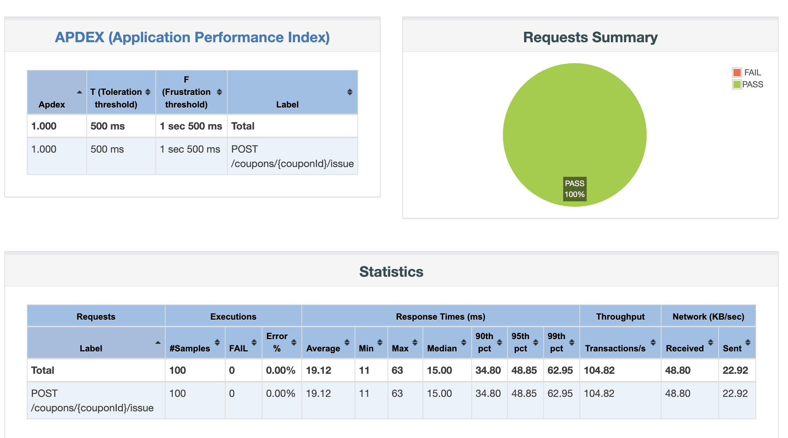

- 1초당 200스레드 > Hikari/Tomcat 설정 후 ✅ 성공
  

- 1초당 400스레드 > ❌ 실패
  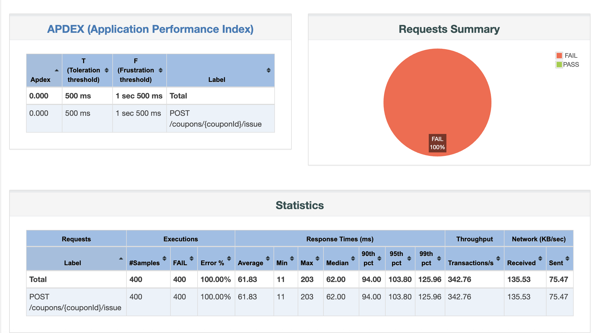

- 3초당 500스레드 > ✅ 성공
  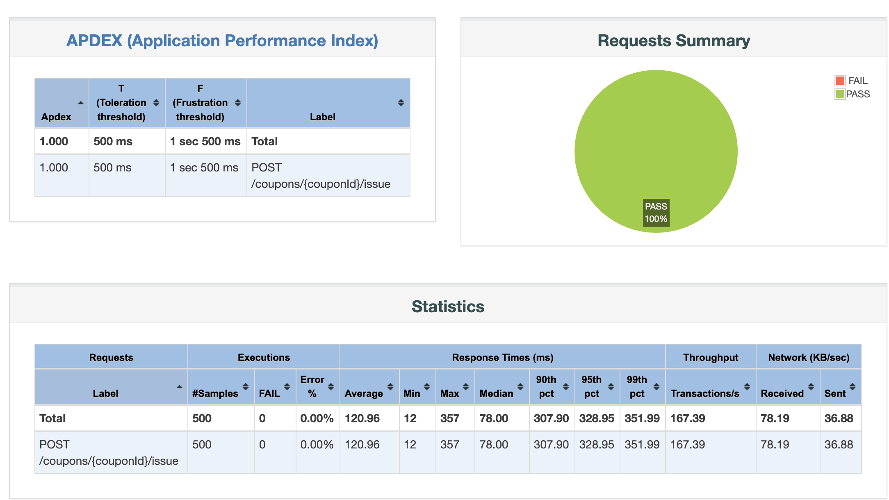

- 6초당 1000스레드 > ✅ 성공
  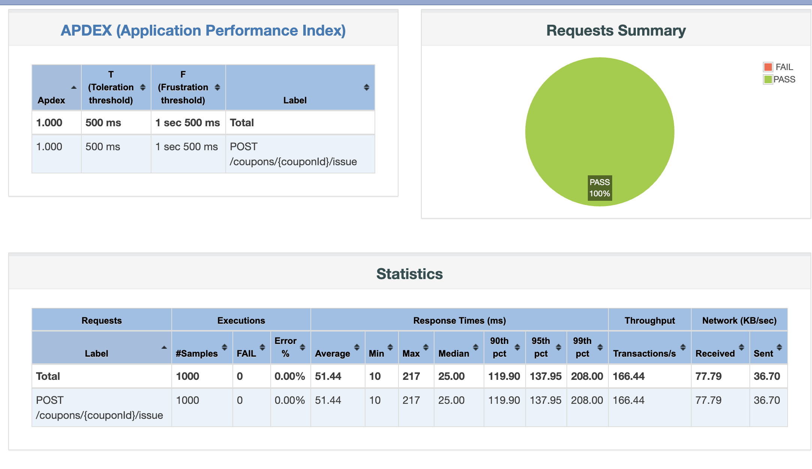

**성능 한계**:
- ✅ **초당 200 req/s**: 안정적 처리 (성공률 100%)
- ⚠️ **초당 300-500 req/s**: 부분 실패 발생 가능
- ❌ **초당 1,000 req/s**: 대량 실패 (성공률 15%)

#### 초당 200개 요청 (Ramp-up 1초) - ✅ 성공
- ✅ **성공률**: 100% (200/200)
- ⏱️ **평균 응답시간**: ~120ms
- 📊 **처리량**: ~200 req/s
- 📌 **결론**: Hikari/Tomcat 설정 후 200 req/s까지 안정적 처리 확인


## 2. 비관적락 > 분산락 전환시 부하테스트 결과

### 1초당 200req
- 비관적 락 사용  성능 테스트 결과
  
- 분산락 사용 성능 테스트 결과
  
- 성능비교표

| 지표 | 비관적 락 | 분산락 | 차이 |
|------|-----------|--------|------|
| **평균 응답 시간** | 567ms | 1,113ms | 2배 느림 |
| **최소 응답 시간** | 91ms | 54ms | - | 
| **중앙값 (50%ile)** | 650ms | 752ms | 16% 느림 |
| **90%ile** | 720ms | 1,977ms | 2.7배 느림 | 
| **95%ile** | 729ms | 2,166ms | 3배 느림 | 
| **최대 응답 시간** | 742ms | 2,676ms | 3.6배 느림 | 
| **처리량 (req/min)** | 133.2 | 63.7 | 2배 높음 | 
| **처리량 (req/sec)** | 2.22 | 1.06 | 2배 높음 | 
| **APDEX 점수** | 0.640 | 0.450 | 42% 높음 | 
| **성공률** | 100% | 100% | 동일 | 
| **에러 발생** | 0건 | 0건 | 동일 |
| **응답시간 편차** | 651ms | 2,622ms | 4배 안정적 |


### 1초당 300req
- 비관적 락 사용  성능 테스트 결과
  
- 분산락 사용 성능 테스트 결과
  
- 비교 : 비관적 락으로 시도시에는 모든 요청이 실패하였으나, 분산락으로 전환 후 모든 요청이 성공하였습니다.


## 3.분산락 > 레디스 스트림즈 전환

### 1초당 200req
- 1차 개선 비관적 락 사용  성능 테스트 결과
  
- 2차 개선 분산락  사용 성능 테스트 결과
  
- 3차 개선 redis stream 사용 성능 테스트 결과
  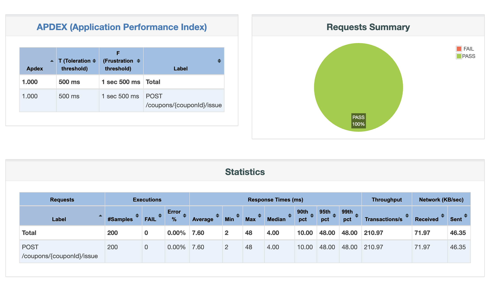
- 성능비교표

| 지표 | 비관적 락 | Redis 분산락 | Redis Stream | 차이 (Stream 기준) |
|------|-----------|--------------|--------------|-------------------|
| **평균 응답 시간** | 1,113ms | 567ms | 7.6ms | 비관적락 대비 146배 빠름 / 분산락 대비 75배 빠름 |
| **최소 응답 시간** | 1ms | 650ms | 0ms | - |
| **중앙값 (50%ile)** | 1,119.5ms | 720ms | 10ms | 비관적락 대비 112배 빠름 / 분산락 대비 72배 빠름 |
| **90%ile** | 1,977ms | 729.9ms | 48ms | 비관적락 대비 41배 빠름 / 분산락 대비 15배 빠름 |
| **95%ile** | 2,167ms | 743ms | 48ms | 비관적락 대비 45배 빠름 / 분산락 대비 15배 빠름 |
| **99%ile** | 2,677ms | 133.16ms | 210.97ms | 비관적락 대비 13배 빠름 / 분산락 대비 1.6배 느림 |
| **최대 응답 시간** | 5,275ms | 1,745ms | 2,484ms | 비관적락 대비 2.1배 빠름 / 분산락 대비 1.4배 느림 |
| **처리량 (req/min)** | 1,782 | 3,726 | 4,318 | 비관적락 대비 2.4배 높음 / 분산락 대비 1.2배 높음 |
| **처리량 (req/sec)** | 29.71 | 62.11 | 71.97 | 비관적락 대비 2.4배 높음 / 분산락 대비 1.2배 높음 |
| **APDEX 점수** | 0.450 | 0.640 | 1.000 | 비관적락 대비 122% 향상 / 분산락 대비 56% 향상 |
| **성공률** | 100% | 100% | 100% | 모두 동일 |
| **에러 발생** | 0건 | 0건 | 0건 | 모두 동일 |
| **응답시간 편차** | 5,274ms | 1,095ms | 2,484ms | 비관적락 대비 2.1배 안정적 / 분산락 대비 2.3배 불안정 |

### 1초당 1000req
- 1초당 1000개 요청시, 초과 발급 되지 않고 1000개 요청 성공하였습니다.
  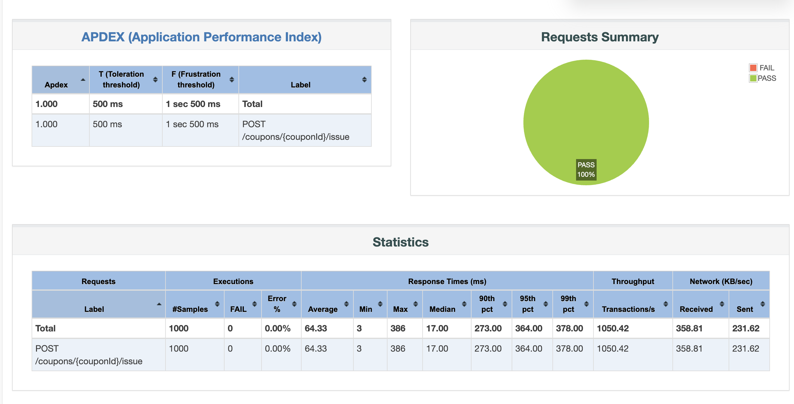

### 3초당 2000req
- 3초당 2000개 요청시 발급 가능 갯수인 1000개만 성공하고 나머지는 실패하는 것으로 동작하고 있습니다.
  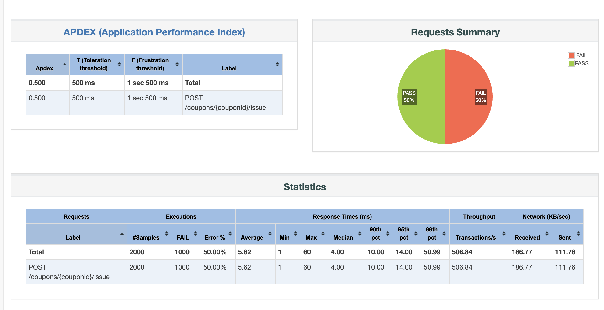

### 1초당 5000req
- 1초당 5000개 요청시 발급 가능 갯수인 1000개만 성공하고 나머지는 실패하는 것으로 동작하고 있습니다.
  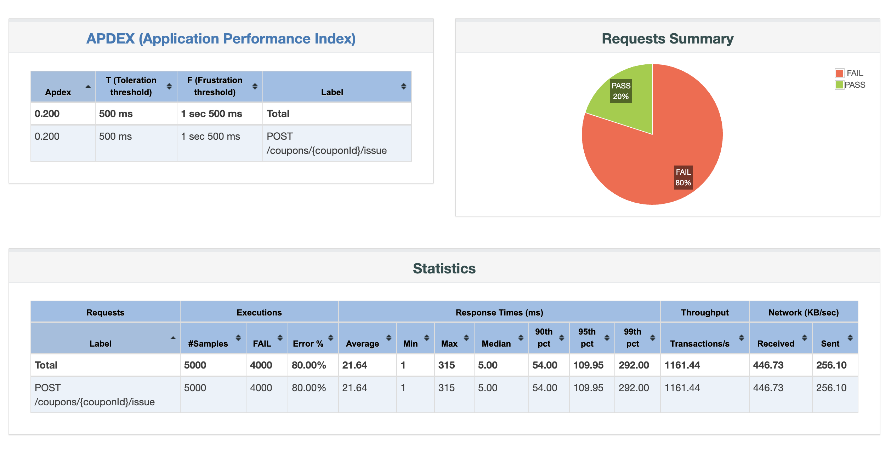


  
# 2. 병목 탐색 및 모니터링
- 병목 탐색을 만들 케이스는 극단적으로 db의 커넥션 풀을 줄이는 것이라고 생각했습니다. 이에 따라 임의로 커넥션 풀을 조정한 뒤 선착순 쿠폰 발급을 테스트 해보았습니다.
- 그라파나와 프로메테우스 설정을 통해 모니터링을 진행해 보았습니다.

- 환경
 - 동시 사용자 수: 500
 - Ramp-up 시간: 10초
 - Loop Count: 100
 - Duration: 60초

1. 정상 상태 확인 (현재 설정)

```properties
## Tomcat Thread Pool (for handling HTTP requests)
server.tomcat.threads.max=500
server.tomcat.threads.min-spare=50
server.tomcat.max-connections=1000
server.tomcat.accept-count=500
server.tomcat.connection-timeout=30000
#
### Hikari Connection Pool
spring.datasource.hikari.maximum-pool-size=50
spring.datasource.hikari.minimum-idle=10
spring.datasource.hikari.connection-timeout=3000
spring.datasource.hikari.validation-timeout=2000
spring.datasource.hikari.idle-timeout=600000
spring.datasource.hikari.max-lifetime=1800000
```
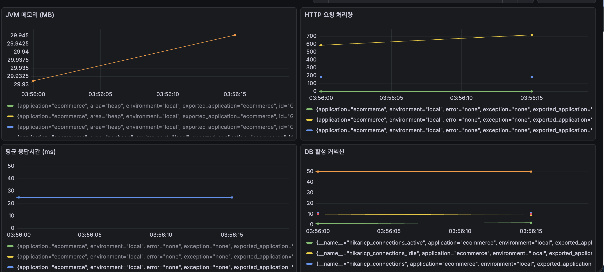


2. Tomcat Thread만 줄이기 → HTTP 처리 병목 확인

```properties
server.tomcat.threads.max=5
server.tomcat.threads.min-spare=2
server.tomcat.max-connections=10
server.tomcat.accept-count=5
server.tomcat.connection-timeout=30000
```

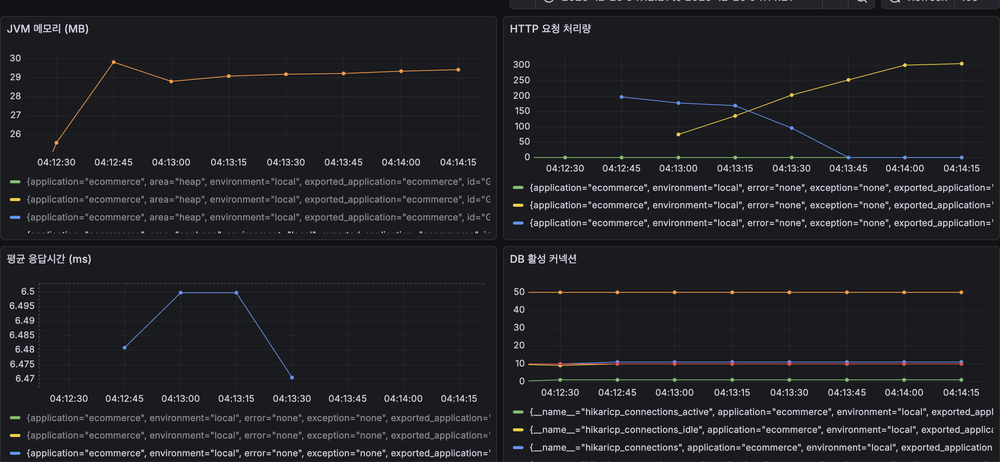


3. HikariCP만 줄이기 → DB 커넥션 병목 확인

```properties
spring.datasource.hikari.maximum-pool-size=3     
spring.datasource.hikari.minimum-idle=1          
spring.datasource.hikari.connection-timeout=3000
```
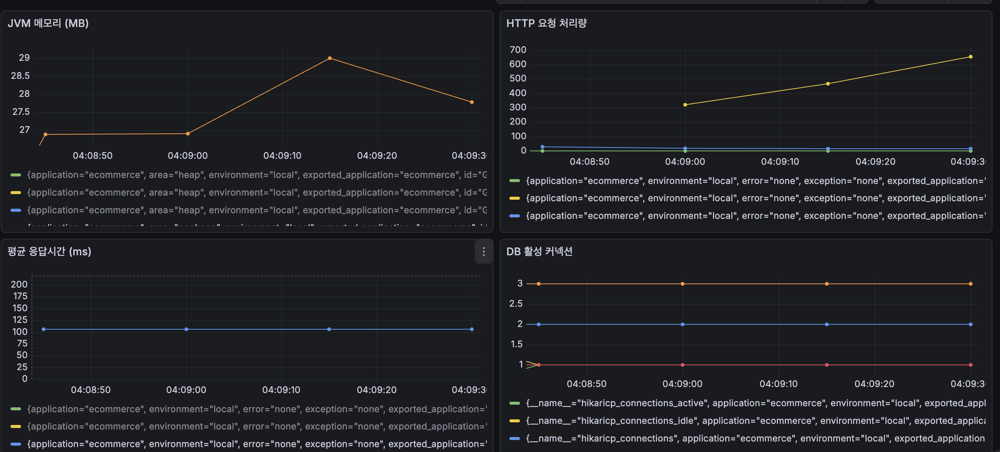


4. 둘 다 줄이기 → 전체 시스템 병목 확인

해당 설정을 바탕으로 모니터링 해본 결과 비교표입니다.
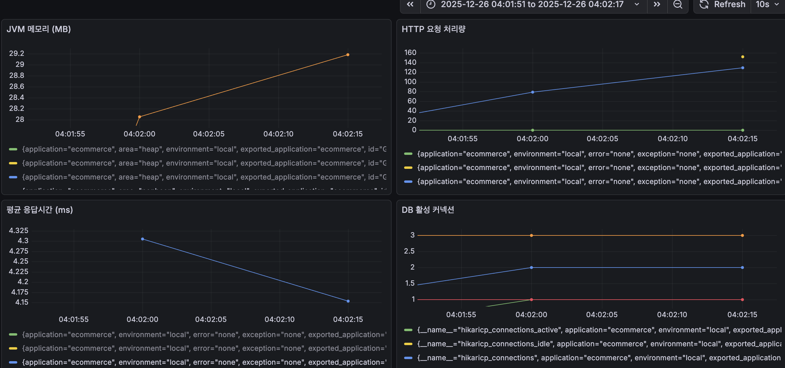


## 피크 테스트 설정별 성능 비교

### 설정 비교표

| 테스트 | Tomcat max-threads | Tomcat max-connections | HikariCP pool-size | HikariCP min-idle |
|--------|-------------------|------------------------|-------------------|------------------|
| 1번 | 500 ✅ | 1000 ✅ | 50 ✅ | 10 |
| 2번 | 5 ❌ | 10 ❌ | 기본값(10) | 기본값 |
| 3번 | 500 ✅ | 1000 ✅ | 3 ❌ | 1 |
| 4번 | 5 ❌ | 10 ❌ | 50 ✅ | 10 |

### 성능 결과 비교

| 지표 | 1번 | 2번 | 3번 | 4번 |
|------|-----|-----|-----|-----|
| HTTP 처리량 (피크) | 700 req/sec | 150 req/sec | 650 req/sec | 300 req/sec |
| HTTP 처리량 (초기) | 600 req/sec | 40 req/sec | 300 req/sec | 200 req/sec |
| 처리량 추세 | 안정적 증가 | 점진적 증가 | 빠르게 증가 | 증가 후 감소 |
| 응답시간 (평균) | 25ms | 4.2ms ⭐ | 100ms | 6.5ms |
| DB 활성 커넥션 | 0개 | 1-2개 | 1개 | 10개 |
| DB Idle 커넥션 | 50개 | 3개 | 3개 | 50개 |
| JVM 메모리 | 29.93-29.945MB | 28-29.2MB | 27-29MB | 25.5-30MB |

### 성능 순위

| 순위 | 테스트 | 처리량 | 응답시간 | 리소스 효율 | 종합 평가 |
|------|--------|--------|---------|------------|----------|
| 🥇 1위 | 1번 | 700 req/sec | 25ms | 높음 | **최고 성능** |
| 🥈 2위 | 3번 | 650 req/sec | 100ms | 매우 높음 | 높은 처리량 |
| 🥉 3위 | 4번 | 300 req/sec | 6.5ms | 중간 | Tomcat 병목 |
| 4위 | 2번 | 150 req/sec | 4.2ms | 낮음 | Thread 심각한 병목 |

### 병목 원인 분석

| 테스트 | 주요 병목 | 처리 가능 여부 | 비고 |
|--------|----------|---------------|------|
| 1번 | 없음 ✅ | 완전 가능 | 최적 설정 |
| 2번 | 🔴 Tomcat Thread (5개) | 심각한 제한 | Thread Pool 고갈 |
| 3번 | 🟡 HikariCP (3개) | 제한적 | DB 커넥션 부족, 응답시간 느림 |
| 4번 | 🔴 Tomcat Thread (5개) | 제한적 | HikariCP는 충분하나 Thread 부족 |

### 설정별 상세 분석

| 테스트 | 설정 특징 | 강점 | 약점 | 최적 시나리오 |
|--------|----------|------|------|--------------|
| 1번 | 모두 높음 (500/50) | 최고 처리량, 안정적 | 리소스 많이 사용 | **프로덕션 환경** |
| 2번 | Tomcat만 낮음 (5/10) | 초고속 응답 | 극도로 낮은 처리량 | 사용 불가 |
| 3번 | HikariCP만 낮음 (500/3) | 높은 처리량 | 응답시간 느림 | 캐시 중심 서비스 |
| 4번 | 불균형 (5/50) | 빠른 응답 | Thread Pool 병목 | 개발/테스트 |

### 리소스 활용도

| 테스트 | Tomcat Thread 사용률 | HikariCP 사용률 | CPU 예상 | 메모리 | 효율성 |
|--------|---------------------|----------------|---------|--------|--------|
| 1번 | 높음 (~100%) | 0% (캐시) | 높음 | 30MB | ⭐⭐⭐⭐⭐ |
| 2번 | 100% (포화) | 10-20% | 낮음 | 28-29MB | ⭐⭐ |
| 3번 | 높음 (~80%) | 33% (1/3) | 높음 | 27-29MB | ⭐⭐⭐⭐ |
| 4번 | 100% (포화) | 20% (10/50) | 중간 | 25-30MB | ⭐⭐⭐ |

### 핵심 발견

| 발견 사항 | 내용 |
|----------|------|
| **Tomcat Thread 영향** | Thread Pool이 성능에 가장 큰 영향 (5개 vs 500개 = 5배 차이) |
| **HikariCP 영향** | Redis 캐시로 인해 영향 미미 (DB 활성 커넥션 거의 없음) |
| **최적 조합** | Tomcat=500 + HikariCP=50 = 700 req/sec |
| **불균형의 위험** | 4번처럼 한쪽만 높으면 병목 해소 안 됨 |
| **Redis 캐시 효과** | 모든 테스트에서 DB 활성 커넥션 0-10개 (캐시가 대부분 처리) |
| **메모리 사용량** | 설정과 무관하게 25-30MB로 비슷 |


# 3. 결론
병목테스트를 위해서 조금 극단적으로 스레드와 커넥션 수를 조정해 보았는데요. 실제로 조정한대로 병목이 일어나고, rps가 떨어지는 것을 시각화하여 볼수 있어서 좋았습니다.
선착순 쿠폰에 대하여 점진적으로 개선하면서 db의 락이나 메시지 브로커를 도입하는 것에만 초점이 가있었는데, 그보다 가장 중요한것은 이런 세팅이 아닐까..하며 역시 뭐든 기초를 탄탄히 해야한다는
생각이 들었습니다... 실무에서 그냥 이미 세팅된 ELK를 사용하다 보니 실제로 세팅해본적은 없었는데 이번 과제를 통해 조금이나마 모니터링 시스템에 대해 공부할 수 있었던 것 같습니다.